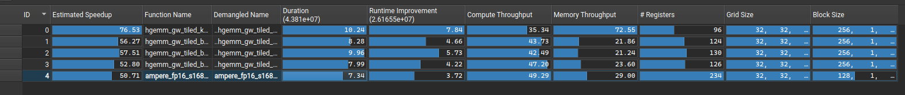

# HGEMM
## profile

## 优化
### hgemm_gw_tiled_kernel
#### grid swizzling
在 M = N = 4096, BM = BN = 128 下，C 被切成：
```
M 方向: 4096 / 128 = 32 个 block tile
N 方向: 4096 / 128 = 32 个 block tile
```
所以 gridDim.x = 32，gridDim.y = 32。每个 block 负责一个 C tile 128x128。

看第一行的 32 个 block：blockIdx.y = 0，blockIdx.x = 0~31：
- 这 32 个 block 共享同一个 A tile（128x4096x4 B = 2MB），但它们分别需要 32 个不同的 B tile（每个 B tile 都是 4096x128）
- 也就是说，为了算完第 0 行 block，GPU 从 global 读取了 2 + 32x2 = 66MB 数据，超过了 L2Cache  32MB。

解法：把 block 访问 global 顺序重排一下，强制将**遍历轨迹**折叠成一个宽度为 8 的垂直长条，在 x 维度遍历 8 个 block 后，立即进入下一行。（默认情况下 cuda 是按照 grid 的 x （N）维度，再 y（M）维度顺序发射的）

这样每 8 个 block 读取一个 A tile（2MB）和 8 个 B tile（16MB）。可以完全驻留 L2。下一行 8 个 block 会读取新的 A tile，但可以完全复用这 8 个 B tile，避免了重复读 global。

```cpp
// grid swizzling
int linear_block_id = blockIdx.y * gridDim.x + blockIdx.x;
const int SWIZZLE_W = 8;

int bx = (linear_block_id % SWIZZLE_W) + (linear_block_id / (SWIZZLE_W * gridDim.y)) * SWIZZLE_W;
int by = (linear_block_id / SWIZZLE_W) % gridDim.y;
```
#### 计算
一个 block 8 个 warp，排成 2x4，总共负责 128x128 的 C，那么每个 warp 负责 64x32。一个 warp 内线程逻辑排布为 8x4。
#### 写回 C
一条 mma.m16n8k16 产生一个 16x8 的 C fragment，它的 128 个元素分散在 warp 的 32 个线程中，每个线程持有 4 个元素。

对于 `sum[m][n][0...3]`，当前线程持有的 4 个元素不是连续的 2x2，而是（row,col）(row,col + 1) (row + 8,col) (row + 8, col + 1)。

```cpp
float sum[4][4][4];
          ↑  ↑  ↑
          │  │  每线程在一个 16×8 fragment 中持有 4 个元素
          │  4 个 N fragment，每个列数 8
          4 个 M fragment，每个行数 16
```

```
                  列 col
          0    1    2    3    4    5    6    7
       ┌────┬────┬────┬────┬────┬────┬────┬────┐
row  0 │ T0 │ T0 │ T1 │ T1 │ T2 │ T2 │ T3 │ T3 │
       ├────┼────┼────┼────┼────┼────┼────┼────┤
row  1 │ T4 │ T4 │ T5 │ T5 │ T6 │ T6 │ T7 │ T7 │
       ├────┼────┼────┼────┼────┼────┼────┼────┤
row  2 │ T8 │ T8 │ T9 │ T9 │T10 │T10 │T11 │T11 │
       ├────┼────┼────┼────┼────┼────┼────┼────┤
row  3 │T12 │T12 │T13 │T13 │T14 │T14 │T15 │T15 │
       ├────┼────┼────┼────┼────┼────┼────┼────┤
row  4 │T16 │T16 │T17 │T17 │T18 │T18 │T19 │T19 │
       ├────┼────┼────┼────┼────┼────┼────┼────┤
row  5 │T20 │T20 │T21 │T21 │T22 │T22 │T23 │T23 │
       ├────┼────┼────┼────┼────┼────┼────┼────┤
row  6 │T24 │T24 │T25 │T25 │T26 │T26 │T27 │T27 │
       ├────┼────┼────┼────┼────┼────┼────┼────┤
row  7 │T28 │T28 │T29 │T29 │T30 │T30 │T31 │T31 │
       ├────┼────┼────┼────┼────┼────┼────┼────┤
row  8 │ T0 │ T0 │ T1 │ T1 │ T2 │ T2 │ T3 │ T3 │
       ├────┼────┼────┼────┼────┼────┼────┼────┤
row  9 │ T4 │ T4 │ T5 │ T5 │ T6 │ T6 │ T7 │ T7 │
       ├────┼────┼────┼────┼────┼────┼────┼────┤
row 10 │ T8 │ T8 │ T9 │ T9 │T10 │T10 │T11 │T11 │
       ├────┼────┼────┼────┼────┼────┼────┼────┤
row 11 │T12 │T12 │T13 │T13 │T14 │T14 │T15 │T15 │
       ├────┼────┼────┼────┼────┼────┼────┼────┤
row 12 │T16 │T16 │T17 │T17 │T18 │T18 │T19 │T19 │
       ├────┼────┼────┼────┼────┼────┼────┼────┤
row 13 │T20 │T20 │T21 │T21 │T22 │T22 │T23 │T23 │
       ├────┼────┼────┼────┼────┼────┼────┼────┤
row 14 │T24 │T24 │T25 │T25 │T26 │T26 │T27 │T27 │
       ├────┼────┼────┼────┼────┼────┼────┼────┤
row 15 │T28 │T28 │T29 │T29 │T30 │T30 │T31 │T31 │
       └────┴────┴────┴────┴────┴────┴────┴────┘
```
每个线程持有其中的 4 个元素（两个相邻元素，再隔 8 行），这四个元素对应到代码中就是 `sum[m][n][0/1/2/3]` 。

理解这个布局写回 C 就容易了：
```cpp
    // store C
    int t_row = laneId / 4;       // 0~7
    int t_col = (laneId % 4) * 2; // 0, 2, 4, 6

#pragma unroll
    for (int m = 0; m < 4; ++m)
    {
#pragma unroll
        for (int n = 0; n < 4; ++n)
        {
            int c_base_row = by * BM + warp_row * 64 + m * 16;
            int c_base_col = bx * BN + warp_col * 32 + n * 8;
            int idx_0 = (c_base_row + t_row) * n + c_base_col + t_col;
            int idx_2 = (c_base_row + t_row + 8) * n + c_base_col + t_col;
            if constexpr (std::is_same_v<T, __half>) {
                HALF2(c[idx_0]) = __float22half2_rn(FLOAT2(sum[m][n][0]));
                HALF2(c[idx_2]) = __float22half2_rn(FLOAT2(sum[m][n][2]));
            } else {
                BFLOAT2(c[idx_0]) = __float22bfloat162_rn(FLOAT2(sum[m][n][0]));
                BFLOAT2(c[idx_2]) = __float22bfloat162_rn(FLOAT2(sum[m][n][2]));
            }
        }
    }
}
```
注意，写 C 的时候也是遍历 16 次（一个 warp 算 64x32，分了 16 次 mma，得到了 16 个 mma 的结果，每个需要分别写入）

### hgemm_gw_tiled_bcf_kernel

#### As: bank conflict 与 swizzle
As 是（128，32），每行 32 个 half 共 64B，占 16 个 bank。所以相邻行的起始 bank：
```
row0：bank0
row1：bank16
row2：bank0
row3：bank16
# 每两行 As 铺满一次 bank
```

**对于一次 ldmatrix 的 8 行**，假设 a_col = 0
- row 0,2,4,6：这四行每行8个half 16B，且这几行开头的bank是0，所以这几行都会读 bank0/1/2/3
- row 1,3,5,7：这四行每行8个half 16B，且这几行开头的bank是16，所以这几行都会读 bank16/17/18/19

因此是 4-way bank conflict。

我们需要找一个映射，$f(row,col)->(row, new\_col)$。

ldmatrix 的列 a_col 只可能是
- 0 =   00000
- 8 =   01000
- 16 =  10000
- 24 =  11000
- 统一表示为 `c4 c3 0 0 0`

高 2 位表示一行中的第几个 8 元素组（ldmatrix load 8x8），即第几个 16B chunk。低 3 位全 0，保证 8 个 half，也就是 16B 对齐。

一个 half 2B，一个 bank 4B，一个 bank 包含 2 个 half，因此从 half 元素地址得到 bank 编号，计算方法是（half 元素地址 / 2），即**右移 1 位，再取低 5 位（0~31）**。

对于 As：`addr = row * 32 + col`
- `* 32` 相当于 左移 5 位，那么低 5 位全 0，再 `+ col`，那么低 5 位就是 `c4 c3 0 0 0`
- 算 bank 编号时，需要再右移 1 位，得 `r0 c4 c3 0 0`

> 例如 col = 0，那么 c4 = c3 = 0，所以 bank 编号为 ` r0 0 0 0 0 `。
> 但是这 8 行中 r0 只有 0 和 1，所以导致 bank 编号只能取 0/16。
> 这就是问题所在：对固定的 col，bank 编号只看到了 row 最低位 r0，完全没看到 r1/r2，因此 8 行只能分到两组 bank，每组 4 行，形成 4-way conflict。

已有的 bank bits 为 `r0 c4 c3 0 0`，要让 8 行分别落到 8 组 bank，就必须让 row 的 3 个 bit（r0/r1/r2）都参与进来。r0 已经有了。

对于 r1 和 r2，最自然的做法是把它们混入 col 的两位：
- new_c4 = c4 ^ r2
- new_c3 = c3 ^ r1

于是新的 bank bits 变为 `r0 (c4 ^ r2) (c3 ^ r1) 0 0`

```cpp
#define SWIZZLE_A(row, col) ((col) ^ (((row >> 1) & 0x3) << 3))
```
#### Bs: bank conflict 与 swizzle
`Bs[32][128]`，一行 128 个 half 256B，占 64 个 bank，所以正好占用两轮。（每一行占的 bank id 都是 0~31，0~31）。

执行一条 ldmatrix 时的 8x8 矩阵，row0 访问 bank0，row1 也访问 bank0...每一行之间都存在 conflict，所以是 8-way conflict。

B 的列为 0 ~ 127，可以写成：`c6 c5 c4 c3 0 0 0`
- 低 3 位全 0，因为 b_col 总是 8 的倍数
- 经过 half 到 bankid 的换算（右移 1 位）后，起始 bank bits 为 `c5 c4 c3 0 0`。这里面完全没有 r，导致所有行，只要 b_col 相同，访问的 bank 就都相同。

我们希望 8 行落到 8 个不同的 bank group。8 行 row 的低 3 位正好是：
```
row0 : 000
row1 : 001
row2 : 010
row3 : 011
row4 : 100
row5 : 101
row6 : 110
row7 : 111
记作 r2 r1 r0
```
因此把这 3 个 bit 分别 XOR 到 col 的 `c5 c4 c3`：
```
new_c5 = c5 ^ r2
new_c4 = c4 ^ r1
new_c3 = c3 ^ r0
```
对于固定的 b_col，row0~7 会生成 8 个不同的 bank group。

```cpp
#define SWIZZLE_B(row, col) ((col) ^ (((row) & 0x7) << 3))
```

### hgemm_gw_tiled_bcf_dbf_kernel
双缓冲流水，与 [SGEMM/double_buffer](../sgemm/README.md#sgemm_at_tiling_bcf_swizzling_cstore_dbf_kernel) 类似。

### hgemm_gw_tiled_bcf_dbf_cstore_kernel
上一版写回 C 时没有做到事务合并：

```cpp
    // store C
    int t_row = laneId / 4;
    int t_col = (laneId % 4) * 2;

#pragma unroll
    for (int m = 0; m < 4; ++m) {
#pragma unroll
        for (int n = 0; n < 4; ++n) {
            int c_base_row = by * BM + warp_row * 64 + m * 16;
            int c_base_col = bx * BN + warp_col * 32 + n * 8;
            if constexpr (std::is_same_v<T, __half>) {
                HALF2(C[(c_base_row + t_row) * N + c_base_col + t_col]) =
                    __float22half2_rn(FLOAT2(sum[m][n][0]));
                HALF2(C[(c_base_row + t_row + 8) * N + c_base_col + t_col]) =
                    __float22half2_rn(FLOAT2(sum[m][n][2]));
            } else {
                BFLOAT2(C[(c_base_row + t_row) * N + c_base_col + t_col]) =
                    __float22bfloat162_rn(FLOAT2(sum[m][n][0]));
                BFLOAT2(C[(c_base_row + t_row + 8) * N + c_base_col + t_col]) =
                    __float22bfloat162_rn(FLOAT2(sum[m][n][2]));
            }
        }
    }
```
只看第一行 strore
```
lane0~3 -> row0, col 0,2,4,6
lane4~7 -> row1, col 0,2,4,6
...
lane28~31 -> row7, col 0,2,4,6
```
每个 lane 写 2 个 half，4B。因此一个 warp 的一次 strore 是
```
row0：4个lane合计写连续16B
...
row7：4个lane合计写连续16B
```
问题是这些 16B 分布在 8 个不同行。每行实际只写了半个 sector 16B。

优化：先让各 warp 把结果写入 shared Cs，再 shared->global。利用 shared 做一次数据重排。

但写 C 会有 bank conflict：Cs 一行 128 个 half，256B，正好两圈 bank。所以 **Cs 里只要列号相同，bank id 就相同。**

就看一个 warp 的第一次写
```
lane0~3 -> row0, col 0,2,4,6  -> bank 0,1,2,3
lane4~7 -> row1, col 0,2,4,6  -> bank 0,1,2,3
...
lane28~31 -> row7, col 0,2,4,6 -> bank 0,1,2,3
```
有 8-way bank conflict。

因此可以使用与 Bs 相同的 swizzle。

再看 shared-> global C。这个时候 shared 就是 128x128，写回 C 也是 128x128 的子块，位置是对应的了。
我们要让一个线程一次用 HALF8 写 16B，这样一行需要 16 个线程，一个 warp 一次能写两行，一个 block 一次能写 16 行。
遍历 8 次即可。