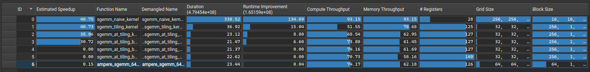

# SGEMM
## Profile

## 优化手段
### sgemm_tiling_kernel
block 包含 256 个线程（16x16），计算 C 的 128x128 的子块，那么每个线程需要计算 8x8 的子块。
- BK = 16，每次沿 K 方向处理 16 个元素。

搬运：
- 一个 block 每次需要把 128x16 的 a 和 16x128 的 b 搬进 shared，各 2048 个 float。
- 用 float4 搬，256 个线程一次也只能搬 1024 个 float，所以需要搬两次。每次搬 64x16 个 a，8x128 个 b。

计算：
- 一个 block 有 8 个 warp，排成 2 行 4 列，每个 warp 需要计算 C 的 64x32。
每个线程需要算 C 的 8x8，所以 warp 内 32 个线程逻辑上排成 8 行 4 列。

### sgemm_at_tiling_kernel
上一个版本在内层循环读取As时，使用循环标量读取：
```cpp
#pragma unroll
        for (int i = 0; i < BK; ++i) {
            float reg_a[TM], reg_b[TN];
#pragma unroll
            for (int m = 0; m < TM; ++m) {
                reg_a[m] = As[c_row + m][i]; // here!
            }
            FLOAT4(reg_b[0]) = FLOAT4(Bs[i][c_col]);
            FLOAT4(reg_b[4]) = FLOAT4(Bs[i][c_col + 4]);
            // ...
        }
```
两个缺点：
- LSU 压力
- 计算循环中频繁的等待数据，会产生很多空泡

优化：将 A 子块**转置**后再存入 shared As，即可使用 float4 读取。
```cpp
    __shared__ float As_T[BK][BM];
    // ...

    for (int bk = 0; bk < k; bk += BK) {
        // 读取 HBM 中连续的 float4，写入 As_T 不同四行
        float4 tmp_a0 =
            FLOAT4(a[(blockIdx.y * BM + load_a_row) * k + bk + load_a_col]);
        As_T[load_a_col + 0][load_a_row] = tmp_a0.x;
        As_T[load_a_col + 1][load_a_row] = tmp_a0.y;
        As_T[load_a_col + 2][load_a_row] = tmp_a0.z;
        As_T[load_a_col + 3][load_a_row] = tmp_a0.w;

        float4 tmp_a1 = FLOAT4(
            a[(blockIdx.y * BM + load_a_row + 64) * k + bk + load_a_col]);
        As_T[load_a_col + 0][load_a_row + 64] = tmp_a1.x;
        As_T[load_a_col + 1][load_a_row + 64] = tmp_a1.y;
        As_T[load_a_col + 2][load_a_row + 64] = tmp_a1.z;
        As_T[load_a_col + 3][load_a_row + 64] = tmp_a1.w;

        // ...

#pragma unroll
        for (int i = 0; i < BK; ++i) {
            // 读取 As_T 时可以使用 float4 读取
            float reg_a[TM], reg_b[TN];

            FLOAT4(reg_a[0]) = FLOAT4(As_T[i][c_row]);
            FLOAT4(reg_a[4]) = FLOAT4(As_T[i][c_row + 4]);

            FLOAT4(reg_b[0]) = FLOAT4(Bs[i][c_col]);
            FLOAT4(reg_b[4]) = FLOAT4(Bs[i][c_col + 4]);

            // ...
    }
```
trade-off：global -> shared 时由于要写入不同四行，只能用标量写入。用外层循环的 “2 个 float4 拆成 8 个标量写入”，换取内层计算循环的 “16x8 次标量读取优化为 16x2 次 float4 读取”。
### sgemm_at_tiling_bcf_swizzling_kernel
**bank conflict 分析**

在转置写入 shared As_T 时：As_T shape 为 (16, 128)，bank_id = (row * 128 + col) % 32。
```cpp
int load_a_row = tid / 4;
int load_a_col = (tid % 4) * 4;
// ...
 As_T[load_a_col + 0][load_a_row] = tmp_a0.x;
```
对于这一条写入，warp 的每 4 个线程会发生 4-way bank conflict：
```
Thread0 -> As_T[0][0]  -> bank0
Thread1 -> As_T[4][0]  -> bank0
Thread2 -> As_T[8][0]  -> bank0
Thread3 -> As_T[12][0] -> bank0

Thread0 -> As_T[0][1]  -> bank1
Thread1 -> As_T[4][1]  -> bank1
Thread2 -> As_T[8][1]  -> bank1
Thread3 -> As_T[12][1] -> bank1

...
```

一般来说，`As_T[x][y]`的 float 地址是 $128x + y$。

$bank(x, y) = (128x + y) \bmod 32$

由于 $128 \bmod 32 = 0$

所以 $bank(x, y)=y \bmod 32$，也就是说，BK 维度的下标 `x` 完全不参与 bank 选择。不同行只要 `y` 相同，就会落到同一个 bank。

**swizzling 公式**

对于发生冲突的 4 个线程 y 相同， x=0, 4, 8, 12，写成 4-bit：
```
x = 0000
x = 0100
x = 1000
x = 1100
```
底 2-bit 相同，高 2-bit 不同。所以可以用 `x >> 2`区分。

Shared Memory 有 32 个 bank，bank_id 为 5-bit：`b4 b3 b2 b1 b0`。在当前场景下，b0~b4 就是 y0~y4，其中 `y2 y1 y0` 3-bit 用来区别一个 warp 中的 `y = load_a_row = 0~7`。

这就正好可以把 `x >> 2`的两个 bit 放到 bank_id 的高两位，也就是 `bank_id = x3 x2 y2 y1 y0`，为此，需要把`x >> 2`左移 3 bit 再 XOR 到 y：`new_y = y ^ ((x >> 2) << 3)`。

### sgemm_at_tiling_bcf_swizzling_cstore_kernel
回写 C 时：
```cpp
for (int i = 0; i < TM; ++i) {
        FLOAT4(c[(blockIdx.y * BM + c_row + i) * n + blockIdx.x * BN + c_col]) =
            FLOAT4(sum[i][0]);
        FLOAT4(c[(blockIdx.y * BM + c_row + i) * n + blockIdx.x * BN + c_col +
                 4]) = FLOAT4(sum[i][4]);
    }
```
只看第一个写操作，warp 相邻线程都在隔着 4 个 float 的空泡写数据。
而 dram/L2 都是按一个 32 字节作为一个 sector 进行。一个线程每行要写 2 次，每次 16 字节，造成了浪费。

优化：重新设计每个线程负责的 8 列：相邻线程划到连续的 float4 地址，比如 t0 读 0~3，T1 读 4~7...，读完一次后，第二次 T0 读 64~67，T1 读 68~71...。这样保证写回 C 时相邻线程地址是合并的。

把 `C[128x128]` 沿行方向分给 8 个 warp：
```
C block tile：128×128

               N 方向：0 ─────────────────────────── 127
                    ┌──────────────────────────────────┐
行   0～15          │ warp 0：16×128                  │
                    ├──────────────────────────────────┤
行  16～31          │ warp 1：16×128                  │
                    ├──────────────────────────────────┤
行  32～47          │ warp 2：16×128                  │
                    ├──────────────────────────────────┤
行  48～63          │ warp 3：16×128                  │
                    ├──────────────────────────────────┤
行  64～79          │ warp 4：16×128                  │
                    ├──────────────────────────────────┤
行  80～95          │ warp 5：16×128                  │
                    ├──────────────────────────────────┤
行  96～111         │ warp 6：16×128                  │
                    ├──────────────────────────────────┤
行 112～127         │ warp 7：16×128                  │
                    └──────────────────────────────────┘
```
以 warp 0 为例：
- lane0~15：前 8 行的 8x128.
	- 1 个线程算 8x8，一字排开，正好 16 个线程算完 8x128
	- 但如果一个线程算连续的 8 列，以 float4 写入会有非合并 global 写入问题，所以一个线程算左边一个 8x4 和 右边一个 8x4。

### sgemm_at_tiling_bcf_swizzling_cstore_dbf_kernel
CUDA LSU 发起内存事务请求，从 global memory 加载数据到寄存器（其实是要过 L2–>L1–>register）, ALU 处于空闲状态。

double buffer 流水线：
- 预先加载一块 a/b 到 `smem_buffer[0]`，同步 `__syncthreads()` 确保写入 smem 完成。
- 循环主体：
	- 先发起请求加载下一块 a/b 到 寄存器。
	- 然后立刻拿 `smem_buffer[0]` 中的数据计算（和上一步 overlap）。
	- 计算完后，再将循环开头加载到寄存器的数据，写入到 `smem_buffer[1]`，同步 `__syncthreads()`。
	- 交换 smem_buffer 指针，开始下一循环
- 收尾阶段
	- 循环结束，计算最后一次 load 的数据块。
	- 将累加寄存器 `sum[8][8]` 写回 c 矩阵的 global memory，算法结束。

其实就是预取下一个 K tile 的 Global，和当前 K tile 的计算 overlap。
# 参考
https://zhuanlan.zhihu.com/p/2012477320007533911